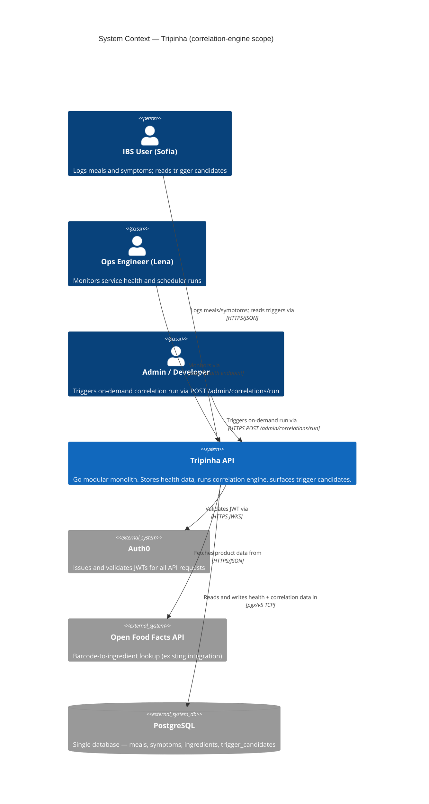
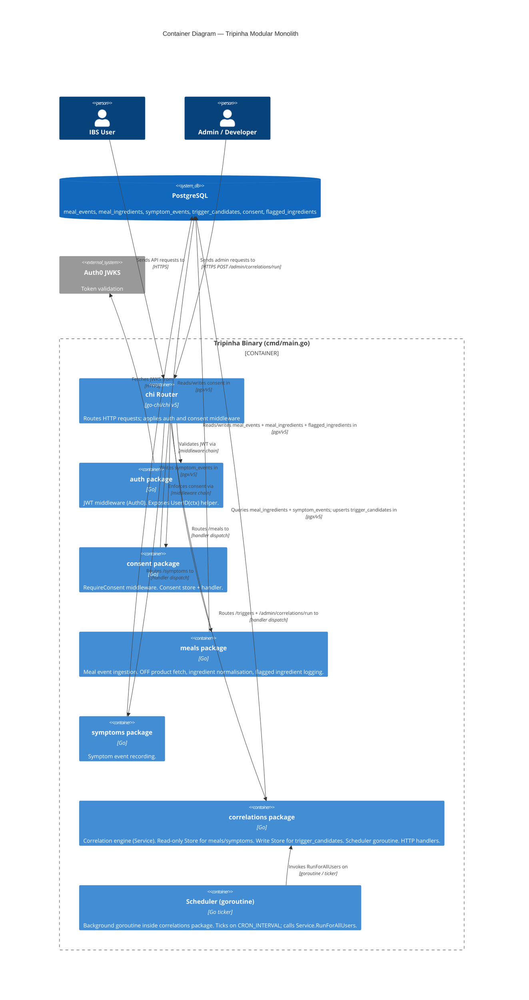
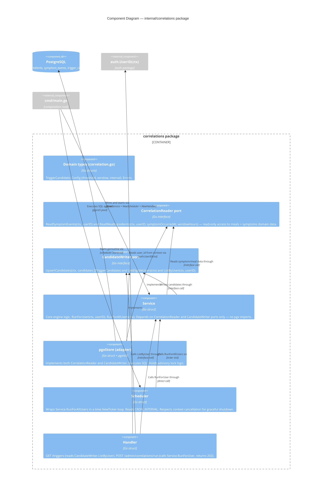

# Architecture Brief — Tripinha

**Project**: Tripinha — IBS dietary trigger management
**Wave**: DESIGN (Application Architecture)
**Feature scope**: `correlation-engine` (issue #7)
**Author**: Morgan (nw-solution-architect)
**Date**: 2026-04-28

---

## System Architecture

> Section owned by Titan (system-architect). Not yet populated — this is the first architecture document for this project.

---

## Domain Model

> Section owned by Hera (domain-architect). Not yet populated.

---

## Application Architecture

### System Context

Tripinha is a Go 1.21 modular monolith serving authenticated IBS users. It stores meal events, ingredient data, symptom events, and — after this feature — computed ingredient-symptom correlation candidates. The correlation engine is an internal subsystem: it reads existing domain data (meals, symptoms), computes correlations, and writes results back to the same PostgreSQL instance. No new external services are introduced.



---

### Container Diagram

The system is a single deployable binary. Logical containers within that binary are represented below.



---

### Component Diagram — `internal/correlations` package

This package has five or more distinct responsibilities, warranting a Component (L3) diagram.



---

### Chosen Architecture: Option A — Single-Port Adapter (Recommended)

See `docs/product/architecture/adr-001-correlation-engine.md` for full decision rationale and alternatives.

**Summary of key decisions:**

| Concern | Decision |
|---|---|
| Package structure | `internal/correlations/` — single new package, consistent with existing pattern |
| Ports | Two interfaces: `CorrelationReader` (read meals/symptoms) + `CandidateWriter` (write/read trigger_candidates) |
| Adapter | Single `pgxStore` struct implements both ports |
| Scheduler placement | In-process `Scheduler` struct in `internal/correlations/`; started from `cmd/main.go` |
| SQL query shape | Single correlated SQL query with `INTERVAL` arithmetic — no application-side loop |
| Admin endpoint auth | Static shared secret via `ADMIN_SECRET` env var checked in a new `adminSecret` middleware |
| Enforcement tooling | `go-arch-lint` or `depguard` to enforce no `pgx` imports in `service.go` |

---

### Technology Stack

| Component | Technology | License | Rationale |
|---|---|---|---|
| Language | Go 1.21 | BSD-3 | Existing project constraint |
| Router | go-chi/chi v5 | MIT | Existing project constraint |
| Database driver | pgx/v5 | MIT | Existing project constraint |
| Database | PostgreSQL | PostgreSQL License (OSS) | Existing project constraint |
| Auth | Auth0 go-jwt-middleware v2 | Apache-2.0 | Existing project constraint |
| Scheduler | `time.NewTicker` (stdlib) | BSD-3 | No external dependency needed; trivial in-process ticker |
| Advisory lock | `pg_try_advisory_xact_lock` (PostgreSQL built-in) | PostgreSQL License | Decided in DISCUSS wave; no additional dependency |
| Architecture enforcement | `go-arch-lint` | MIT | Enforces port/adapter dependency rules via YAML config |

No new dependencies are introduced. All new code is idiomatic Go using the existing stdlib and project libraries.

---

### Integration Patterns

**Internal (within monolith):**
- `Service` depends on two interfaces (`CorrelationReader`, `CandidateWriter`) — never on concrete pgx types
- `Scheduler` depends on `Service` only — not on the store directly
- `Handler` depends on `CandidateWriter` (for GET /triggers) and `Service` (for POST /admin/correlations/run)
- Dependency direction: `Handler` → `Service` → ports ← `pgxStore` (adapts outward)

**No new external integrations** are introduced by this feature. Open Food Facts (existing) is used only by the meals package.

**Composition root** (`cmd/main.go`) wires all dependencies in order: db pool → pgxStore → Service → Scheduler → Handler → routes.

---

### Quality Attribute Strategies

#### Correctness / Security (Priority 1)
- All queries to `trigger_candidates` and source tables include `WHERE user_id = $1` with the JWT-derived user_id (never from request body)
- `auth.UserID(ctx)` is the single source of truth for identity in every handler
- Advisory lock key is `hashtext(user_id)` — per-user isolation prevents cross-contamination of concurrent runs
- Admin endpoint protected by `ADMIN_SECRET` header check — no JWT user_id involved (engine runs as system process)

#### Testability (Priority 2)
- `Service` has zero `pgx` imports — all DB access through interfaces
- `pgxStore` is the only struct that imports `pgx` in this package
- Unit tests for `Service` use in-memory fakes implementing `CorrelationReader` and `CandidateWriter`
- `Scheduler` tested by injecting a fake `Service` — ticker behaviour tested with short interval

#### Maintainability (Priority 3)
- Package structure mirrors `internal/meals`: domain types → interfaces → service → store adapter → handler
- Enforced by `go-arch-lint`: `service.go` must not import `github.com/jackc/pgx`
- No framework-specific coupling in domain or service layers

#### Performance (Priority 4)
- `GET /triggers`: simple `SELECT ... WHERE user_id = $1` with index on `(user_id)` — p99 < 500ms achievable at any realistic data volume
- Engine SQL: single query with `INTERVAL` arithmetic computed in PostgreSQL — no round-trip per symptom event
- Index on `meal_events(user_id, scanned_at)` exists (migration 002) — supports window query
- Pagination deferred per DISCUSS decision; flag for review if trigger candidates per user exceeds ~200

#### Observability
The Outcome KPI measurement plan (KPI #4: "tick complete: N users processed, M skipped") depends on structured log lines. The `Scheduler` and `Service` MUST emit the following events at minimum:

| Event | Log fields | Level |
|---|---|---|
| Scheduler tick started | `interval`, `user_count` | INFO |
| Per-user run completed | `user_id` (hashed/truncated), `candidates_upserted` | INFO |
| Per-user advisory lock skipped | `user_id` (hashed/truncated), `reason=lock_held` | WARN |
| Per-user run failed | `user_id` (hashed/truncated), `error` | ERROR |
| Tick completed | `users_processed`, `users_skipped`, `users_failed`, `duration_ms` | INFO |
| Scheduler stopped | `reason=context_cancelled` | INFO |

All log lines use the existing `log.Printf` pattern in the codebase (stdlib `log`). `user_id` in log lines should be truncated to first 8 characters to avoid leaking full Auth0 subject strings in logs.

---

### Deployment Architecture

Single binary deployment — no changes to deployment topology. The `Scheduler` goroutine starts with the binary and shares its lifecycle with the HTTP server via the shared `context.Context` from `signal.NotifyContext`.

Startup sequence in `cmd/main.go`:
1. Parse and validate all env vars (`CRON_INTERVAL`, `CORRELATION_THRESHOLD`, `LOOKBACK_WINDOW_HOURS`, `ADMIN_SECRET`)
2. Connect pgxpool
3. Wire `correlations` package
4. Start `scheduler.Start(ctx)` goroutine
5. Start HTTP server

Graceful shutdown: `signal.NotifyContext` cancels the shared context → scheduler goroutine exits on next tick → HTTP server drains connections → `db.Close()`.

---

### Architecture Enforcement

Add `.go-arch-lint.yml` to project root. Rule: `service.go` in `internal/correlations` must not import `github.com/jackc/pgx`. This prevents inadvertent bypassing of the ports/adapters boundary.

Recommended CI step:
```
go-arch-lint check
```

This runs in < 1 second and catches dependency inversions before code review.

---

### Open Questions (for user decision)

| # | Question | Impact |
|---|---|---|
| OQ-1 | **Admin endpoint auth**: Is `ADMIN_SECRET` static shared secret acceptable, or is a separate Auth0 M2M client required? | Security posture of admin endpoint |
| OQ-2 | **`ADMIN_SECRET` rotation**: If static secret chosen, what is the rotation policy? | Operational security |
| OQ-3 | **Eligible users query index**: `SELECT DISTINCT user_id FROM symptom_events` performs a full table scan without an index on `symptom_events(user_id)`. **Recommendation**: migration 005 SHOULD add `CREATE INDEX IF NOT EXISTS idx_symptom_events_user_id ON symptom_events(user_id)` unless an existing index already covers this. Crafter should confirm with `\d symptom_events` before deciding. | Performance at scale |
| OQ-4 | **`correlation_count` semantics on re-run**: Current decision is cumulative across all symptom windows in DB. If the engine re-runs with a shorter lookback window, old windows are not subtracted — count only grows. Is monotonic count acceptable, or should the engine recompute from scratch each time? | Correctness of stale counts |
